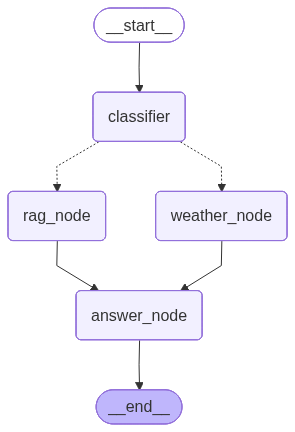

# 🌤️ Weather & Style Agent

> An intelligent LangGraph agent that routes user queries between real-time weather data and expert fashion advice using RAG (Retrieval Augmented Generation).


## 📖 Overview

This project implements a **conditional routing agent**, it intelligently decides whether a user needs:
1.  **Real-Time Data:** Fetches live weather from the OpenWeatherMap API.
2.  **Expert Knowledge:** Retrieves fashion/fabric advice from a local Qdrant vector store (RAG).

It uses **LangGraph** to manage the state and workflow, **AWS Bedrock** for LLM/Embeddings, and **Streamlit** for the chat interface.

## 🏗️ Architecture

The agent follows a Router-Tool pattern:

1.  **Classifier Node:** Analyzes user intent and extracts entities (City vs. Search Query).
2.  **Conditional Edge:** Routes the flow to either `weather_node` or `rag_node`.
3.  **Tool Nodes:** Execute the specific API call or Vector Search.
4.  **Answer Node:** Synthesizes the retrieved context into a final natural language response.

## 📂 Project Structure

```text
weather-rag-agent/
├── .env                    # API Keys 
├── app.py                  # Streamlit User Interface
├── evaluate.py             # LangSmith Evaluation Script
├── requirements.txt        # Dependencies
├── data/                   # Assets (PDFs and Test JSONs)
│   ├── clothing_documents/ # Place PDFs here
│   └── evaluation_dataset.json
├── src/
│   ├── config.py           # Configuration & Env Loading
│   ├── graph.py            # LangGraph Workflow Definition
│   ├── ingest.py           # PDF Ingestion Script
│   ├── state.py            # Pydantic Models & State TypedDict
│   └── tools.py            # OpenWeatherAPI and RAG tools
└── tests/
    ├── conftest.py         # Pytest Fixtures
    ├── test_graph.py       # Graph Logic Tests
    └── test_tools.py       # Tool Unit Tests
```
## 🧭 Architecture Diagram




# 🚀 Installation

### **Clone the repository**

``` bash
git clone https://github.com/your-username/weather-rag-agent.git
cd weather-rag-agent
```

### **Create a virtual environment**

``` bash
python -m venv venv
source venv/bin/activate     # On Windows: venv\Scripts\activate
```

### **Install dependencies**

``` bash
pip install -r requirements.txt
```

### **Configure Environment Variables**

Create a **.env** file in the project root:

``` ini
# .env file

# 1. Weather API (Required)
OPENWEATHER_API_KEY="your_openweather_key"
OPENWEATHER_BASE_URL="https://api.openweathermap.org/data/2.5/weather"

# 2. AWS Bedrock Credentials (Required)
AWS_ACCESS_KEY_ID="your_aws_key"
AWS_SECRET_ACCESS_KEY="your_aws_secret"
REGION_NAME="us-east-1"

# 3. Model IDs (Defaults provided in config.py)
ROUTER_MODEL_ID="us.amazon.nova-lite-v1:0"
ANSWER_MODEL_ID="us.amazon.nova-pro-v1:0"
EMBEDDING_MODEL_ID="amazon.titan-embed-text-v2:0"

# 4. LangSmith Evaluation (Optional)
LANGCHAIN_API_KEY="your_langsmith_key"
LANGCHAIN_TRACING_V2=true
```

# 💻 Usage

### **1. Ingest Knowledge (RAG)**

Populate the vector database with your fashion PDFs.

``` bash
python src/ingest.py
```

### **2. Run the Web App**

Launch the Streamlit interface.

``` bash
streamlit run app.py
```

# 🧪 Testing & Evaluation

## **Unit Tests**

Current Test Status: 100% Passing

    tests/test_graph.py::test_intent_classifier_weather PASSED      [ 11%]
    tests/test_graph.py::test_decide_next_node PASSED              [ 22%]
    tests/test_graph.py::test_weather_node_integration PASSED      [ 33%]
    tests/test_graph.py::test_rag_node_integration PASSED          [ 44%]
    tests/test_tools.py::test_fetch_weather_success PASSED         [ 55%]
    tests/test_tools.py::test_fetch_weather_city_not_found PASSED  [ 66%]
    tests/test_tools.py::test_fetch_weather_no_input PASSED        [ 77%]
    tests/test_tools.py::test_query_qdrant_success PASSED          [ 88%]
    tests/test_tools.py::test_query_qdrant_empty PASSED            [100%]

    ======================= 9 passed in 2.60s =======================

### **Run tests locally**

``` bash
python -m pytest -v
```

## **LLM Evaluation using LangSmith**

``` bash
python evaluate.py
```

# 🛠️ Tech Stack

-   **Orchestration:** LangGraph\
-   **LLMs:** AWS Bedrock (Nova Lite, Nova Pro)\
-   **Vector Database:** Qdrant (Local)\
-   **External API:** OpenWeatherMap\
-   **Testing:** Pytest, Unittest.mock\
-   **Evaluation:** LangSmith SDK

# 📝 License

This project is licensed under the **MIT License**.
